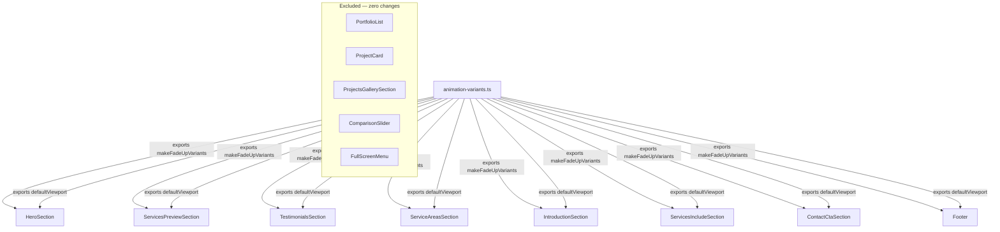
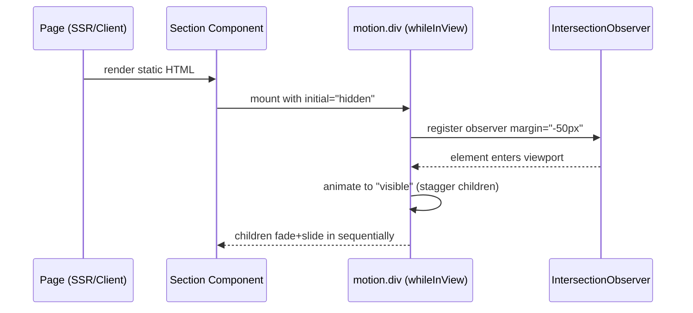

# Design Document: Scroll & Entry Animations

## Overview

Add elegant Framer Motion entry and scroll-triggered animations to all static components on the Resendiz Landscaping landing page. Components that already have complex Framer Motion implementations (`PortfolioList`, `ProjectCard`, `ProjectsGallerySection`, `ComparisonSlider`) are excluded. The goal is a cohesive, premium feel: every section reveals itself as it enters the viewport, using opacity + y transforms only, staggered children, and the project's canonical easing curve `[0.25, 1, 0.5, 1]`.

## Architecture

The animation layer sits entirely on top of the existing component tree. No business logic, routing, or data-fetching is affected. The central `animation-variants.ts` module is the single source of truth for all timing, easing, and variant definitions. Each animated component imports from that module and wraps its own DOM nodes with `motion.*` primitives.



The IntersectionObserver (managed internally by Framer Motion's `whileInView`) fires once per element (`once: true`) with a `-50px` margin, triggering the variant transition from `hidden` → `visible`. The stagger cascade is defined purely in the container variant's `transition.staggerChildren` value — no imperative sequencing is needed.

## Components and Interfaces

### animation-variants.ts (new)

**Purpose**: Central variants module — the single place where timing, easing, and transform values are defined.

**Interface**:
```typescript
interface FadeUpVariantsOptions {
  duration?: number;        // default: 0.65
  y?: number;               // default: 30
  staggerChildren?: number; // default: 0.12
  delayChildren?: number;   // default: 0
}

type AnimationVariants = {
  container: Variants; // opacity only + stagger gate
  item: Variants;      // opacity + y transform
};

function makeFadeUpVariants(options?: FadeUpVariantsOptions): AnimationVariants;
const defaultViewport: { once: true; margin: "-50px" };
```

**Responsibilities**:
- Produce container + item `Variants` pairs for `whileInView` stagger patterns
- Export `heroVariants` for the page-load (non-scroll) HeroSection animation
- Export `defaultViewport` config consumed by all `whileInView` wrappers
- Enforce the canonical easing `[0.25, 1, 0.5, 1]` in every `item.visible.transition`

### HeroSection (modified)

**Purpose**: Page-load cascade animation — heading, tagline, and CTA buttons stagger in on mount.

**Responsibilities**:
- Add `"use client"` directive
- Wrap `.relative.z-10` div with `motion.div` using `initial/animate` (not `whileInView`)
- Animate 3 children: `h1`, tagline div, CTA buttons div

### ServicesPreviewSection (modified)

**Purpose**: Scroll-triggered stagger of the two service-link cards.

**Responsibilities**:
- Wrap `<section>` with `motion.section` as stagger container
- Use `motion.create(Link)` for each card to preserve `<Link>` semantics
- Stagger delay: 0.15s

### TestimonialsSection (modified)

**Purpose**: Fade-up the section heading; leave the Marquee untouched.

**Responsibilities**:
- Wrap heading `<h3>` only with `motion.h3 variants={item}`
- Must NOT wrap or interfere with the Marquee animation loop

### ServiceAreasSection (modified)

**Purpose**: Two-column stagger — left text column and right areas card reveal independently.

**Responsibilities**:
- Use two separate `motion.div` containers (one per column) rather than a single stagger gate
- Left column: 4 children staggered; right card: single fade-up with slight delay

### IntroductionSection (modified)

**Purpose**: Multi-zone stagger — badge/heading/divider group, image column, text column, and TaskCard wrappers each animate.

**Responsibilities**:
- `TaskCard` component itself stays a plain component
- `IntroductionSection` provides `motion.div variants={item}` wrappers around each TaskCard instance
- Badge + heading + divider staggered as first group; columns and cards follow

### ServicesIncludeSection (modified)

**Purpose**: Single fade-up for the outer grid container.

**Responsibilities**:
- Wrap only the outermost `rounded-none overflow-hidden shadow-xl` div
- Preserve all `onMouseEnter`/`onMouseLeave` handlers

### ContactCtaSection (modified)

**Purpose**: Scroll-triggered stagger of heading, description, and CTA link.

**Responsibilities**:
- Add `"use client"` directive
- Animate 3 items: `h2`, `p`, `Link`
- Must NOT animate background Image or overlay div

### Footer (modified)

**Purpose**: Subtle 3-column stagger as footer enters viewport.

**Responsibilities**:
- Add `"use client"` directive
- Animate left column, right column group, center copyright — stagger 0.1s

## Data Models

### AnimationVariants

```typescript
type AnimationVariants = {
  container: Variants;
  item: Variants;
};

// container shape
{
  hidden:  { opacity: 0 },
  visible: {
    opacity: 1,
    transition: {
      staggerChildren: number,  // ≥ 0
      delayChildren: number     // ≥ 0
    }
  }
}

// item shape
{
  hidden:  { opacity: 0, y: number },  // y > 0 (starts below)
  visible: {
    opacity: 1,
    y: 0,
    transition: {
      duration: number,                // > 0
      ease: [0.25, 1, 0.5, 1]         // canonical — never changed
    }
  }
}
```

**Validation Rules**:
- `ease` is always `[0.25, 1, 0.5, 1]` — no override permitted
- `y` in `hidden` is always positive (elements slide up, never down or sideways)
- `opacity` transitions only between `0` and `1`
- `container.hidden.opacity` is always `0`; `container.visible.opacity` is always `1`

### ViewportConfig

```typescript
type ViewportConfig = {
  once: true;       // literal true — never false
  margin: "-50px";  // literal string — never changed
};
```

**Validation Rules**:
- `once` must be `true` — animations must not replay on scroll-up
- `margin` must be `"-50px"` — trigger point is 50px before element edge

### FadeUpVariantsOptions

```typescript
type FadeUpVariantsOptions = {
  duration?: number;        // default 0.65; must be > 0
  y?: number;               // default 30;   must be > 0
  staggerChildren?: number; // default 0.12; must be ≥ 0
  delayChildren?: number;   // default 0;    must be ≥ 0
};
```

## Main Algorithm/Workflow



## Core Interfaces/Types

```typescript
import { Variants } from "motion/react";

// Shared variant factory — produces consistent fade+slide variants
// Used by every animated section
interface FadeUpVariantsOptions {
  duration?: number;       // default: 0.65
  y?: number;              // default: 30
  staggerChildren?: number; // default: 0.12
  delayChildren?: number;  // default: 0
}

type AnimationVariants = {
  container: Variants;  // opacity + stagger gate
  item: Variants;       // opacity + y transform
};

// whileInView viewport config — identical across all sections
interface ViewportConfig {
  once: true;
  margin: "-50px";
}
```

## Key Functions/Methods

```typescript
// src/lib/animation-variants.ts
// Central module — all sections import from here

/**
 * Returns a container + item Variants pair for whileInView stagger animations.
 * Preconditions: options values are positive numbers if provided
 * Postconditions: container.visible triggers staggerChildren; item.visible
 *   animates opacity 0→1 and y offset→0
 */
function makeFadeUpVariants(options?: FadeUpVariantsOptions): AnimationVariants

/**
 * Variants for page-load animations (HeroSection).
 * Uses `animate` instead of `whileInView`.
 * Postconditions: hero content cascades in on mount with increasing delay
 */
const heroVariants: AnimationVariants

/**
 * Viewport config object — frozen constant, same for all whileInView calls.
 * once: true prevents re-triggering; margin shifts trigger point 50px early
 */
const defaultViewport: ViewportConfig
```

## Algorithmic Pseudocode

### makeFadeUpVariants

```pascal
FUNCTION makeFadeUpVariants(options)
  INPUT: options (optional FadeUpVariantsOptions)
  OUTPUT: AnimationVariants

  duration       ← options.duration       ?? 0.65
  yOffset        ← options.y              ?? 30
  stagger        ← options.staggerChildren ?? 0.12
  delayChildren  ← options.delayChildren  ?? 0

  container ← {
    hidden:  { opacity: 0 },
    visible: {
      opacity: 1,
      transition: {
        staggerChildren: stagger,
        delayChildren:   delayChildren
      }
    }
  }

  item ← {
    hidden:  { opacity: 0, y: yOffset },
    visible: {
      opacity: 1,
      y: 0,
      transition: {
        duration: duration,
        ease: [0.25, 1, 0.5, 1]
      }
    }
  }

  RETURN { container, item }
END FUNCTION
```

### Per-Component Animation Strategy

```pascal
ALGORITHM applyWhileInView(component, container, item)
  INPUT:  component – a static React section
  OUTPUT: component wrapped with motion variants

  // Outer wrapper becomes the stagger gate
  REPLACE <section> OR <div className="root"> WITH
    <motion.section
      variants={container}
      initial="hidden"
      whileInView="visible"
      viewport={{ once: true, margin: "-50px" }}
    >

  // Each direct child that should animate independently becomes an item
  FOR each animatable child IN component DO
    WRAP child IN <motion.div variants={item} />
  END FOR

  // Children that must remain plain (Image fill, absolute overlays) are NOT wrapped
  // Tailwind classes on wrappers are NEVER modified
END ALGORITHM
```

### HeroSection — page-load variant

```pascal
ALGORITHM animateHero()
  // Hero triggers on mount, not scroll — uses initial + animate
  heroContainer ← {
    hidden:  { opacity: 0 },
    visible: {
      opacity: 1,
      transition: { staggerChildren: 0.18, delayChildren: 0.2 }
    }
  }

  heroItem ← {
    hidden:  { opacity: 0, y: 24 },
    visible: {
      opacity: 1, y: 0,
      transition: { duration: 0.7, ease: [0.25, 1, 0.5, 1] }
    }
  }

  WRAP <div className="relative z-10 ...">  WITH
    <motion.div variants={heroContainer} initial="hidden" animate="visible">
      <motion.h1     variants={heroItem} />   // slot 1
      <motion.div    variants={heroItem} />   // slot 2 — tagline (design|build|maintain)
      <motion.div    variants={heroItem} />   // slot 3 — CTA buttons wrapper
    </motion.div>
```

## Component-by-Component Specification

### 1. HeroSection

- **Trigger:** `initial="hidden" animate="visible"` (page load, not scroll)
- **Animated nodes:** h1, tagline div, CTA buttons div — 3 staggered items
- **DO NOT animate:** background Image, overlay div (absolute positioned, must stay static)
- **Directive:** Add `"use client"` — motion requires client component

### 2. ServicesPreviewSection

- **Trigger:** `whileInView` on the `<section>` wrapper
- **Animated nodes:** each `<Link>` card (2 items staggered)
- **Note:** Cards already have CSS hover effects; `motion.create(Link)` must be used to wrap `<Link>` (same pattern as `ProjectCard.tsx`)
- **Stagger delay:** 0.15s between cards

### 3. TestimonialsSection

- **Trigger:** `whileInView` on the section
- **Animated nodes:** heading `<h3>` only — the Marquee itself must NOT be wrapped (it manages its own animation loop)
- **Simple fade-up** for the heading, no stagger needed

### 4. ServiceAreasSection

- **Trigger:** `whileInView` on outer section
- **Animated nodes:** left column (4 children staggered), right card (single fade-up, slight delay)
- **Strategy:** Two separate `motion.div` containers — one for text column, one for the areas card

### 5. IntroductionSection

- **Trigger:** `whileInView`
- **Animated nodes:**
  - Section badge `<p>` + heading `<h2>` + divider `<div>` — staggered
  - Image column (left grid item)
  - Text column (right grid item)
  - Each `TaskCard` wrapper in the grid — staggered with `staggerChildren: 0.15`
- **Note:** `TaskCard` itself stays a plain component; the wrapping `motion.div` in `IntroductionSection` provides the variants

### 6. ServicesIncludeSection

- **Trigger:** `whileInView`
- **Animated nodes:** The outer grid container (`rounded-none overflow-hidden shadow-xl`) as a single fade-up item
- **Note:** Keep `onMouseEnter/onMouseLeave` intact; wrap only the outer div with `motion.div`

### 7. ContactCtaSection

- **Trigger:** `whileInView`
- **Animated nodes:** heading `<h2>`, description `<p>`, CTA `<Link>` — 3 staggered items
- **DO NOT animate:** background Image, overlay div
- **Directive:** Add `"use client"`

### 8. Footer

- **Trigger:** `whileInView`
- **Animated nodes:** left column, right column group, center copyright — 3 staggered items
- **Stagger delay:** 0.1s (subtle, footer is dense)
- **Directive:** Add `"use client"`

## Example Usage

```typescript
// src/lib/animation-variants.ts
import { Variants } from "motion/react";

export const defaultViewport = { once: true, margin: "-50px" } as const;

export function makeFadeUpVariants(options?: FadeUpVariantsOptions) {
  const duration = options?.duration ?? 0.65;
  const y = options?.y ?? 30;
  const stagger = options?.staggerChildren ?? 0.12;
  const delayChildren = options?.delayChildren ?? 0;

  const container: Variants = {
    hidden: { opacity: 0 },
    visible: {
      opacity: 1,
      transition: { staggerChildren: stagger, delayChildren },
    },
  };

  const item: Variants = {
    hidden: { opacity: 0, y },
    visible: {
      opacity: 1,
      y: 0,
      transition: { duration, ease: [0.25, 1, 0.5, 1] },
    },
  };

  return { container, item };
}

// Usage in ServiceAreasSection.tsx
"use client";
import { motion } from "motion/react";
import { makeFadeUpVariants, defaultViewport } from "@/lib/animation-variants";

const { container, item } = makeFadeUpVariants({ staggerChildren: 0.1 });

export function ServiceAreasSection() {
  return (
    <motion.section
      variants={container}
      initial="hidden"
      whileInView="visible"
      viewport={defaultViewport}
      // ...existing className unchanged
    >
      <motion.div variants={item}>{/* left column */}</motion.div>
      <motion.div variants={item}>{/* right areas card */}</motion.div>
    </motion.section>
  );
}
```

## Key Constraints

```typescript
// INVARIANTS that must hold throughout implementation:

// 1. No Tailwind class modification
//    assert: className props are identical to original after refactor

// 2. Only opacity + y transforms
//    assert: no scale, rotate, x, skew, or filter in variants

// 3. viewport.once === true on all whileInView calls
//    assert: animations do not re-trigger on scroll-up

// 4. Excluded components are untouched
//    assert: PortfolioList, ProjectCard, ProjectsGallerySection,
//            ComparisonSlider, FullScreenMenu — zero diff

// 5. "use client" added to any server component that gains motion imports
//    assert: HeroSection, ContactCtaSection, Footer gain "use client"

// 6. Import source consistency
//    assert: all new motion imports use "motion/react" (not "framer-motion")
//    note:   ProjectsGallerySection already uses "framer-motion" — leave it,
//            do NOT change its imports
```

## Correctness Properties

*A property is a characteristic or behavior that should hold true across all valid executions of a system — essentially, a formal statement about what the system should do. Properties serve as the bridge between human-readable specifications and machine-verifiable correctness guarantees.*

### Property 1: Easing Immutability

*For any* valid `FadeUpVariantsOptions` passed to `makeFadeUpVariants`, the returned `item.visible.transition.ease` must equal `[0.25, 1, 0.5, 1]`.

**Validates: Requirements 1.3**

### Property 2: Variant Shape Invariants

*For any* valid `FadeUpVariantsOptions` passed to `makeFadeUpVariants`, the returned variants must satisfy: `container.hidden.opacity === 0`, `container.visible.opacity === 1`, `item.hidden.opacity === 0`, `item.visible.opacity === 1`, and `item.visible.y === 0`.

**Validates: Requirements 1.4**

### Property 3: Transform Axis Restriction

*For any* valid `FadeUpVariantsOptions` passed to `makeFadeUpVariants`, the returned `container` and `item` variant objects must contain only `opacity` and `y` as animated properties — no `x`, `scale`, `rotate`, `skew`, or CSS filter properties shall appear.

**Validates: Requirements 1.5**

### Property 4: Single-Play Guarantee

*For all* `whileInView` calls across all Animated_Components, `viewport.once` must be `true` and `viewport.margin` must be `"-50px"`.

**Validates: Requirements 11.2**

### Property 5: Tailwind Class Preservation

*For all* modified components, every `className` string on every DOM element must be byte-for-byte identical to the original — only the element tag may change (e.g., `div` → `motion.div`).

**Validates: Requirements 11.3**

### Property 6: Excluded Component Immutability

*For all* files in the Excluded_Components set (`PortfolioList.tsx`, `ProjectCard.tsx`, `ProjectsGallerySection.tsx`, `ComparisonSlider.tsx`, `FullScreenMenu.tsx`), the file content must be byte-for-byte identical before and after the implementation.

**Validates: Requirements 10.1**

### Property 7: Import Source Consistency

*For all* new `motion` imports added to any modified file, the import source must be `"motion/react"`.

**Validates: Requirements 11.1**

### Property 8: Client Boundary Correctness

*For all* component files that import from `"motion/react"` and render `motion.*` elements, the file must have `"use client"` as its first line.

**Validates: Requirements 11.4**

## Error Handling

### E1 — Server component receives motion element

**Condition**: A component that imports `motion` from `"motion/react"` is rendered as a React Server Component (no `"use client"` directive).

**Response**: Next.js build fails with a serialization error. The `"use client"` directive must be added to `HeroSection`, `ContactCtaSection`, and `Footer` as part of this implementation.

**Recovery**: Add `"use client"` as the very first line of the affected file. All components already marked as client components (`ServicesPreviewSection`, `TestimonialsSection`, etc.) are unaffected.

### E2 — Marquee animation conflict

**Condition**: A `motion` wrapper is placed around the `<Marquee>` component in `TestimonialsSection`, interrupting its internal animation loop.

**Response**: The marquee scrolling stops or behaves erratically.

**Recovery**: Only the heading `<h3>` above the Marquee is wrapped. The `<Marquee>` element and its children are never touched.

### E3 — Link wrapped incorrectly in ServicesPreviewSection

**Condition**: A `<motion.div>` is placed *around* a `<Link>` instead of using `motion.create(Link)`, producing an invalid DOM nesting (`<a>` inside `<a>`) or breaking the link's `href`.

**Response**: TypeScript or ESLint error at build time; navigation may break at runtime.

**Recovery**: Use `const MotionLink = motion.create(Link)` and render `<MotionLink variants={item} href={...}>` — the same pattern used in `ProjectCard.tsx`.

### E4 — Absolute-positioned overlay animated

**Condition**: The background `<Image>` or overlay `<div>` in `HeroSection` or `ContactCtaSection` is wrapped in a `motion.*` element with `opacity: 0` initial state.

**Response**: The section appears blank (no background) until the animation completes, causing a flash of white.

**Recovery**: Animate only content nodes (headings, paragraphs, buttons). Background and overlay elements must remain outside any `motion.*` container that has `initial="hidden"`.

### E5 — TypeScript type errors from variants

**Condition**: A variant object is constructed with an incorrect shape (e.g., misspelled key, wrong value type) and passed to a `motion.*` element.

**Response**: TypeScript compiler error; build fails.

**Recovery**: Import `Variants` from `"motion/react"` and type all variant objects explicitly as `const x: Variants = { ... }`. The `makeFadeUpVariants` return type is `AnimationVariants`, which enforces correct shapes.

## Testing Strategy

### Unit Testing Approach

- Verify `makeFadeUpVariants` returns correct `container` and `item` shapes
- Assert `item.visible.transition.ease` equals `[0.25, 1, 0.5, 1]`
- Assert `container.visible.transition.staggerChildren` matches input

### Visual / Integration Testing

- Render each animated section in a test browser
- Confirm elements start at `opacity: 0, y: 30` and reach `opacity: 1, y: 0`
- Confirm animation does NOT replay when scrolling back up (`once: true`)
- Confirm excluded components are byte-for-byte unchanged

### Regression Testing

- Run `bun run build` — zero TypeScript errors, zero ESLint warnings
- Visually inspect mobile (375px) and desktop (1440px) — no layout shifts

## Dependencies

- `motion` v12 (already installed) — imported as `motion/react`
- No new packages required
- Central variants module: `src/lib/animation-variants.ts` (new file)
